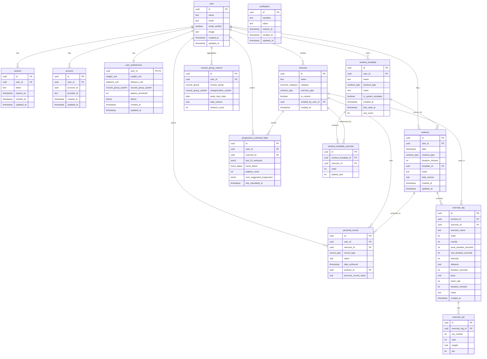

# Database Entity Diagram

```mermaid
erDiagram
  user ||--o{ session : has
  user ||--o{ account : has
  user ||--|| user_preferences : has
  user ||--o{ workout : logs
  user ||--o{ workout_template : owns
  user ||--o{ personal_record : tracks
  user ||--o{ progressive_overload_state : stores
  user ||--o{ muscle_group_volume : aggregates
  user ||--o{ exercise : creates

  workout ||--o{ exercise_log : includes
  exercise_log ||--o{ exercise_set : has
  exercise ||--o{ exercise_log : used_in

  workout_template ||--o{ workout_template_exercise : contains
  exercise ||--o{ workout_template_exercise : referenced_by
  workout_template ||--o{ workout : source_for

  exercise ||--o{ personal_record : sets
  workout ||--o{ personal_record : achieved_in
  exercise ||--o{ progressive_overload_state : trends

  user {
    uuid id PK
    text name
    text email
    boolean email_verified
    text image
    timestamp created_at
    timestamp updated_at
  }

  user_preferences {
    uuid user_id PK, FK
    weight_unit weight_unit
    distance_unit distance_unit
    muscle_group_system muscle_group_system
    int plateau_threshold
    theme theme
    timestamp created_at
    timestamp updated_at
  }

  session {
    uuid id PK
    uuid user_id FK
    text token
    timestamp expires_at
    timestamp created_at
    timestamp updated_at
  }

  account {
    uuid id PK
    uuid user_id FK
    uuid account_id
    text provider_id
    timestamp created_at
    timestamp updated_at
  }

  verification {
    uuid id PK
    text identifier
    text value
    timestamp expires_at
    timestamp created_at
    timestamp updated_at
  }

  exercise {
    uuid id PK
    text name
    exercise_category category
    workout_type exercise_type
    boolean is_custom
    uuid created_by_user_id FK
    timestamp created_at
  }

  workout {
    uuid id PK
    uuid user_id FK
    timestamp date
    workout_type workout_type
    int duration_minutes
    uuid template_id FK
    text notes
    real total_volume
    timestamp created_at
    timestamp updated_at
  }

  exercise_log {
    uuid id PK
    uuid workout_id FK
    uuid exercise_id FK
    text exercise_name
    int order
    int rounds
    int work_duration_seconds
    int rest_duration_seconds
    int intensity
    real distance
    int duration_seconds
    real pace
    int heart_rate
    int duration_minutes
    text notes
    timestamp created_at
  }

  exercise_set {
    uuid id PK
    uuid exercise_log_id FK
    int set_number
    int reps
    real weight
    int rpe
  }

  workout_template {
    uuid id PK
    uuid user_id FK
    text name
    workout_type workout_type
    text notes
    boolean is_system_template
    timestamp created_at
    timestamp last_used_at
    int use_count
  }

  workout_template_exercise {
    uuid id PK
    uuid workout_template_id FK
    uuid exercise_id FK
    int order
    int default_sets
  }

  personal_record {
    uuid id PK
    uuid user_id FK
    uuid exercise_id FK
    record_type record_type
    real value
    timestamp date_achieved
    uuid workout_id FK
    real previous_record_value
  }

  progressive_overload_state {
    uuid id PK
    uuid user_id FK
    uuid exercise_id FK
    jsonb last_10_workouts
    trend_status trend_status
    int plateau_count
    jsonb next_suggested_progression
    timestamp last_calculated_at
  }

  muscle_group_volume {
    uuid id PK
    uuid user_id FK
    muscle_group muscle_group
    muscle_group_system categorization_system
    date week_start_date
    real total_volume
    int workout_count
  }
```
